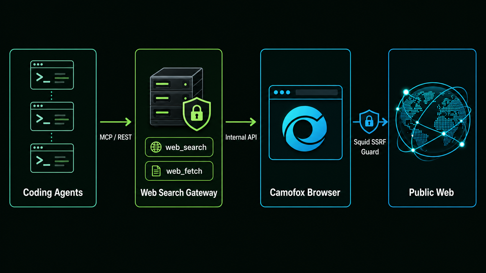

# Camofox Web Search

[English](./README.md) · [简体中文](./README.zh-CN.md) · [Documentation](https://idefav.github.io/web-search/en/)

A self-hosted, remote-first `web_search` and `web_fetch` service for Codex, Claude Code, OpenCode, Pi, and custom Agents. It wraps the pinned Camofox Browser REST API without maintaining a fork and exposes authenticated REST plus stateless Streamable HTTP MCP.

## Why Camofox Web Search

- **One service for every Agent:** connect Codex, Claude Code, OpenCode, Pi, LangChain, or any MCP/REST client to the same endpoint.
- **Browser-backed search and fetch:** render JavaScript pages through Camofox instead of relying on a search API key, while keeping the browser implementation pinned and replaceable.
- **Resilient multi-provider search:** DuckDuckGo, Brave, Bing, and Google are pluggable and ordered; blocked providers enter cooldown and automatically fall through to the next provider.
- **Safer by design:** only read-only tools are exposed, Bearer authentication is mandatory, outbound traffic is isolated behind an SSRF-filtering proxy, and web content is explicitly marked untrusted.
- **Deployment and integration included:** version-pinned Docker Compose, multi-architecture GHCR images, typed REST client, OpenAPI contract, Agent installer, Pi plugin, and runnable examples ship together.
- **Observable and automation-friendly:** structured errors, health checks, Prometheus metrics, stateless MCP, deterministic package versions, and real Docker E2E are part of the supported path.

## What's new in v0.0.3

- Improved WeChat Official Account article fetching with a bounded readiness wait for transient verification interstitials and empty or iframe-only snapshots.
- Added typed, retryable `fetch_blocked` responses with HTTP 503 and `Retry-After` when interactive verification persists.
- Removed temporary WeChat `poc_token` values from returned final URLs while retaining final-URL SSRF validation.
- Added configurable fetch readiness timeout, structured readiness logs, Prometheus metrics, bilingual guidance, and real WeChat Docker E2E coverage.

Read the complete [v0.0.3 release notes](https://github.com/idefav/web-search/releases/tag/v0.0.3) or browse [all releases](https://github.com/idefav/web-search/releases).

## Architecture



- `apps/server`: authenticated REST and stateless MCP gateway.
- `packages/core`: contracts, pluggable search providers, URL safety, and browser orchestration.
- `packages/client`: typed REST client.
- `packages/cli`: idempotent Agent configuration installer.
- `plugins/pi`: native Pi tools.
- `deploy`: pinned Docker deployment with isolated browser networking.
- `examples`: manual Agent configurations and a custom LangChain Deep Agents research Agent.

Only the two high-level, read-only tools are exposed. Browser clicking, typing, script evaluation, cookie import, and authenticated browsing are intentionally out of scope.

## Server deployment

The supported production path is Docker Compose on a 64-bit Linux host with Docker Engine, Compose v2, Git, and OpenSSL. Use the same version for the source tag and GHCR image:

```bash
VERSION="0.0.3"
git clone --branch "v${VERSION}" --depth 1 https://github.com/idefav/web-search.git
cd web-search
WEB_SEARCH_IMAGE="ghcr.io/idefav/web-search:${VERSION}" ./deploy/bootstrap.sh
```

The default gateway listens only on `127.0.0.1:8080`. To expose it with automatic HTTPS, point a domain at the host, allow ports 80/443, and set the domain during bootstrap:

```bash
WEB_SEARCH_DOMAIN="search.example.com" \
WEB_SEARCH_IMAGE="ghcr.io/idefav/web-search:${VERSION}" \
./deploy/bootstrap.sh
```

Bootstrap creates `.env` with mode `0600`, generates different public and internal keys, pulls the pinned stack, and waits for Camofox readiness. Do not rerun it with `--force` during upgrades because that rotates both keys.

Read the complete [server deployment guide](https://idefav.github.io/web-search/en/deployment/) for existing reverse proxies, verification, logs, metrics, upgrades, rollback, network security, and troubleshooting. GitHub Pages hosts documentation only; it cannot execute the browser service.

Search uses the stable-first provider chain `duckduckgo,brave,bing,google` by default. A blocked provider is cooled down for five minutes and the request automatically falls back to the next provider. Override the order with `WEB_SEARCH_PROVIDERS`; Google is always limited to one concurrent attempt. The project does not bypass CAPTCHA or search-engine controls.

`web_fetch` performs one bounded readiness wait when a page initially exposes only an empty or iframe placeholder. This covers WeChat Official Account links that briefly pass through an automatic verification interstitial. A verification page that does not clear is returned as retryable `fetch_blocked`; the service never attempts to solve CAPTCHA.

## Connect an Agent

```bash
npm install -g camofox-web-search
export WEB_SEARCH_API_KEY="<copy securely from the server .env>"

camofox-web-search install codex --endpoint https://search.example.com --scope user
camofox-web-search doctor codex --endpoint https://search.example.com --scope user
```

Replace `codex` with `claude`, `opencode`, or `pi` as needed. The installer stores only the endpoint and an environment-variable reference, never the token. Use `--dry-run` to inspect changes, `--force` to replace a conflicting managed entry, and `doctor --live` to include a real search.

For Pi, installation also runs `pi install npm:camofox-web-search-pi` and configures the native REST-backed tools.

## API

```bash
curl --fail https://search.example.com/v1/search \
  -H "Authorization: Bearer $WEB_SEARCH_API_KEY" \
  -H "Content-Type: application/json" \
  -d '{"query":"Camofox browser","count":5,"freshness":"month"}'

curl --fail https://search.example.com/v1/fetch \
  -H "Authorization: Bearer $WEB_SEARCH_API_KEY" \
  -H "Content-Type: application/json" \
  -d '{"url":"https://example.com/","max_chars":20000}'
```

Search supports `query`, `count`, `freshness`, `include_domains`, `exclude_domains`, `language`, and `country`. Fetch supports `url`, `offset`, and `max_chars`. See `/openapi.json` and the exported TypeScript types for the complete contract.

All returned web text is untrusted input. Tool descriptions and output delimiters warn Agents not to execute instructions found in pages, but callers must retain their own prompt-injection policy.

## Examples

- [`examples/deepagents`](./examples/deepagents): runnable Python 3.11+ custom research Agent using MCP or REST tools, with standard LangChain models or a custom OpenAI-compatible provider.
- [`examples/agent-configs`](./examples/agent-configs): exact Codex, Claude Code, OpenCode, and Pi manual configuration examples.

The [examples guide](https://idefav.github.io/web-search/en/examples/) also includes direct REST calls. The CLI remains the recommended Agent installation path.

Use `--stream` with the Deep Agents example to print Agent steps, tool activity, and answer tokens in real time.

## Development and verification

Requires Node.js 22 or newer.

```bash
npm install
npm run typecheck
npm test
npm run build
npm run docs:build
npm run docs:check
```

Start the gateway against an existing Camofox server:

```bash
export WEB_SEARCH_API_KEY="$(openssl rand -hex 32)"
export CAMOFOX_ACCESS_KEY="$(openssl rand -hex 32)"
export CAMOFOX_URL=http://127.0.0.1:9377
npm run dev
```

With the full Docker stack running, `npm run e2e:docker` validates REST authentication, real page fetch, metadata-address rejection, live multi-provider search or explicit typed failure, MCP discovery/call, and Camofox tab cleanup.

## Release delivery

- `CI`: TypeScript, unit tests, docs build, Deep Agents offline tests, package dry-runs, Compose validation, and gateway image build.
- `GitHub Pages`: builds and publishes the bilingual site after relevant changes reach `main`.
- `Release`: publishes a multi-architecture GHCR image and the four npm packages through Trusted Publishing and OIDC.
- `Docker E2E`: runs the real pinned browser stack weekly and on demand.

See the [deployment guide](https://idefav.github.io/web-search/en/deployment/) for upgrades and rollback, and the existing release workflow for npm/GHCR publication.

## Upstream compatibility

The browser image is pinned to Camofox Browser 1.13.0 and its multi-platform digest. Provider parsers depend on the v1.13.0 accessibility snapshot contract; fixture tests intentionally fail on incompatible changes. Upgrade the image only through a reviewed dependency change that passes contract and opt-in live tests.
