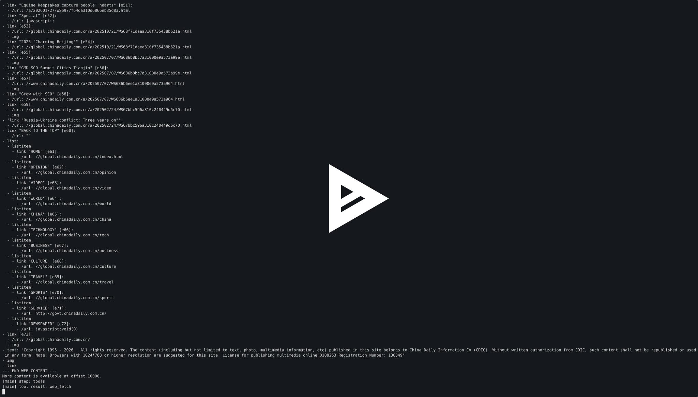

# Camofox Web Search

[English](./README.md) · [简体中文](./README.zh-CN.md) · [在线文档](https://idefav.github.io/web-search/zh-CN/) · [深度文章](https://idefav.github.io/web-search/zh-CN/article/)

面向 Codex、Claude Code、OpenCode、Pi、OpenClaw、HermesAgent 与自定义 Agent 的自托管 Web Search 服务。项目封装固定版本的 Camofox Browser REST API，不维护上游 Fork，同时提供带认证的 REST、无状态 Streamable HTTP MCP 和原生 Provider 插件。

## 项目特色

- **所有 Agent 共用一个服务：** Codex、Claude Code、OpenCode、Pi、OpenClaw、HermesAgent、LangChain 或任意 MCP/REST 客户端都能连接同一个 endpoint。
- **保留原生标准工具：** OpenClaw 继续使用 `web_search`/`web_fetch`，HermesAgent 继续使用 `web_search`/`web_extract`，无需增加 MCP 工具前缀。
- **浏览器驱动的搜索与抓取：** 通过 Camofox 渲染 JavaScript 页面，不依赖商业搜索 API Key，同时保持浏览器实现固定版本且可替换。
- **多 Provider 自动容错：** DuckDuckGo、Brave、Bing、Google 可插拔、可排序；Provider 被拦截后进入冷却，并自动切换到下一个。
- **默认安全：** 只开放只读工具，强制 Bearer 认证，出站流量经过带 SSRF 防护的隔离代理，并明确将网页内容标记为不可信输入。
- **部署与接入完整交付：** 同时提供固定版本 Docker Compose、多架构 GHCR 镜像、类型安全 REST 客户端、OpenAPI、Agent 安装器、Pi/OpenClaw/HermesAgent 原生插件和可运行示例。
- **可观测、易自动化：** 类型化错误、健康检查、Prometheus metrics、无状态 MCP、统一包版本和真实 Docker E2E 都属于正式支持路径。

| Agent | 接入方式 | 原生工具 |
| --- | --- | --- |
| Codex、Claude Code、OpenCode | Streamable HTTP MCP | `web_search`、`web_fetch` |
| Pi | 原生 npm 扩展 | `web_search`、`web_fetch` |
| OpenClaw | 原生 npm Provider | `web_search`、`web_fetch` |
| HermesAgent | 原生 Python Provider | `web_search`、`web_extract` |
| LangChain Deep Agents 与自定义 Agent | MCP、REST 或类型安全客户端 | 由应用定义 |

## 为你的 Agent 安装

先部署[服务端](https://idefav.github.io/web-search/zh-CN/deployment/)，然后在运行 Agent 的机器上安装配置 CLI：

```bash
npm install -g camofox-web-search
export WEB_SEARCH_API_KEY="<通过安全方式从服务端 .env 复制>"
```

### Codex、Claude Code 与 OpenCode

这三个 Agent 通过 Streamable HTTP MCP 接入，不需要安装额外的原生插件包：

```bash
camofox-web-search install codex --endpoint https://search.example.com --scope user
camofox-web-search install claude --endpoint https://search.example.com --scope user
camofox-web-search install opencode --endpoint https://search.example.com --scope user
```

重启对应 Agent 后即可让它调用 `web_search`。使用同一 target 的 `doctor` 验证配置：

```bash
camofox-web-search doctor codex --endpoint https://search.example.com --scope user --live
```

### Pi

```bash
camofox-web-search install pi --endpoint https://search.example.com --scope user
camofox-web-search doctor pi --endpoint https://search.example.com --scope user --live
pi
```

安装器会执行 `pi install npm:camofox-web-search-pi`，并配置通过 REST 调用服务端的原生 `web_search` 与 `web_fetch` 工具。

### OpenClaw

```bash
camofox-web-search install openclaw --endpoint https://search.example.com --scope user
# Gateway 作为服务运行时，把 WEB_SEARCH_API_KEY 持久化到 ~/.openclaw/.env。
openclaw gateway restart
camofox-web-search doctor openclaw --endpoint https://search.example.com --scope user --live
openclaw tui
```

安装器会执行 `openclaw plugins install npm:camofox-web-search-openclaw`、选中原生 Provider，并写入环境变量 SecretRef 而不是 Token。完整说明见 [OpenClaw 指南](https://idefav.github.io/web-search/zh-CN/openclaw/)。

### HermesAgent

```bash
camofox-web-search install hermes --endpoint https://search.example.com --scope user
# 把 WEB_SEARCH_API_KEY 持久化到 ~/.hermes/.env。
camofox-web-search doctor hermes --endpoint https://search.example.com --scope user --live
hermes -t web chat --tui
```

安装器会把 `camofox-web-search-hermes` 加入 Hermes Python 环境、启用插件，并选中原生搜索/提取 backend。完整说明见 [HermesAgent 指南](https://idefav.github.io/web-search/zh-CN/hermes/)。

### LangChain Deep Agents 与自定义 Agent

自定义 Agent 可以直接使用 `/mcp`、REST API 或 `camofox-web-search-client`。可运行的 Deep Agents 示例不需要原生插件：

```bash
cd examples/deepagents
cp .env.example .env
uv sync --locked
uv run --env-file .env python agent.py --transport mcp --stream \
  "研究 Camofox Browser 并引用主要来源"
```

详细说明见 [`examples/deepagents`](./examples/deepagents)与[手工 MCP 配置](./examples/agent-configs)。

Codex、Claude Code、OpenCode 与 Pi 也支持 `--scope project`；OpenClaw 与 HermesAgent 插件只支持 user scope。可添加 `--dry-run` 预览改动，或在明确需要替换冲突配置时添加 `--force`。

## v0.0.5 更新内容

- 修复 HermesAgent 0.20 插件发现入口，使其兼容当前插件加载器。
- CLI 支持发现官方 Hermes Shell 启动器、`venv`/`.venv` 目录与 Hermes 自带的 `uv`，不再要求环境内安装 `pip`。
- `doctor hermes` 改为验证真实运行时 Provider 注册，而不只是导入插件包。
- 加强 `doctor openclaw`，插件加载失败时不会再仅凭声明的 Provider ID 误报成功。
- README 与 GitHub Pages 首页增加全部受支持 Agent 的快捷安装命令，并提供完整的 OpenClaw、HermesAgent 独立指南。

查看完整的 [v0.0.5 Release Notes](https://github.com/idefav/web-search/releases/tag/v0.0.5)或[全部版本](https://github.com/idefav/web-search/releases)。

## 架构


- `apps/server`：带认证的 REST 与 MCP gateway。
- `packages/core`：公开契约、可插拔搜索 Provider、URL 安全和浏览器编排。
- `packages/client`：类型安全的 REST 客户端。
- `packages/cli`：可幂等执行的 Agent 配置安装器。
- `plugins/pi`：Pi 原生工具。
- `plugins/openclaw`：发布到 npm 的 OpenClaw 原生搜索/抓取 Provider。
- `plugins/hermes`：发布到 PyPI 的 HermesAgent 原生搜索/提取 Provider。
- `deploy`：浏览器网络隔离、镜像固定的 Docker 部署。
- `examples`：Agent 手工配置与 LangChain Deep Agents 自定义研究 Agent。

服务只公开两个高层只读工具，不提供浏览器点击、输入、脚本执行、Cookie 导入或登录态浏览。

## 部署服务端

生产部署主线是安装了 Docker Engine、Compose v2、Git 和 OpenSSL 的 64 位 Linux 主机。源码 tag 与 GHCR 镜像必须使用同一个版本：

```bash
VERSION="0.0.5"
git clone --branch "v${VERSION}" --depth 1 https://github.com/idefav/web-search.git
cd web-search
WEB_SEARCH_IMAGE="ghcr.io/idefav/web-search:${VERSION}" ./deploy/bootstrap.sh
```

默认只监听 `127.0.0.1:8080`。需要公网自动 HTTPS 时，先把域名解析到服务器并放行 80/443，再执行：

```bash
WEB_SEARCH_DOMAIN="search.example.com" \
WEB_SEARCH_IMAGE="ghcr.io/idefav/web-search:${VERSION}" \
./deploy/bootstrap.sh
```

Bootstrap 会以 `0600` 权限创建 `.env`，生成不同的公开与内部 Key，拉取固定版本的完整服务栈并等待 Camofox 就绪。升级时不要使用 `--force`，否则两把 Key 都会被轮换。

已有反向代理、部署验证、日志与 metrics、升级回滚、网络安全和排障请查看完整的[服务端部署指南](https://idefav.github.io/web-search/zh-CN/deployment/)。GitHub Pages 只托管文档，不能运行浏览器服务。

默认按稳定优先顺序使用 `duckduckgo,brave,bing,google`。某个 Provider 被拦截后会进入五分钟冷却，并自动切换到下一个 Provider；可通过 `WEB_SEARCH_PROVIDERS` 调整顺序。Google 始终限制为单并发。项目不会绕过 CAPTCHA 或搜索引擎访问控制。

`web_fetch` 遇到首次 snapshot 为空或只有 iframe 占位时，会执行一次有界的页面就绪等待，可处理微信公众号链接短暂经过自动验证中间页的情况。验证页未自动恢复时会返回可重试的 `fetch_blocked`；服务不会尝试解决 CAPTCHA。

## 安装器行为

安装器只保存 endpoint 和环境变量引用，不会保存 Token。它会保留无关设置、为修改的 Agent 配置文件创建备份，并支持幂等重复执行。Codex、Claude Code、OpenCode 与 Pi 的手工配置位于 [`examples/agent-configs`](./examples/agent-configs)。

## OpenClaw 安装与使用

OpenClaw 2026.7.1+ 可以通过原生 Provider 接入，同时保留标准工具名称：

```bash
export WEB_SEARCH_API_KEY="<通过安全方式从服务端 .env 复制>"
camofox-web-search install openclaw \
  --endpoint https://search.example.com \
  --scope user

# 使用受管 Gateway 时，还需把 WEB_SEARCH_API_KEY 持久化到 ~/.openclaw/.env。
openclaw gateway restart
camofox-web-search doctor openclaw \
  --endpoint https://search.example.com \
  --scope user --live
openclaw tui
```

安装器使用 OpenClaw 环境变量 SecretRef，不会把 Token 写入 `openclaw.json`。通过 systemd 或 launchd 管理的 Gateway 必须能从 `~/.openclaw/.env` 或 Service Environment 读取 Key；只在交互式 Shell 中执行 `export` 无法持久生效。

完整步骤请查看 [OpenClaw 安装、使用、代理、验证与卸载指南](https://idefav.github.io/web-search/zh-CN/openclaw/)。想从部署到真实检索完整走一遍，可阅读[图文实战教程：给 OpenClaw 装上真正可控的 Web Search](https://idefav.github.io/web-search/zh-CN/openclaw-tutorial/)。[OpenClaw 示例](./examples/openclaw)还提供等价的手工配置。

## HermesAgent 安装与使用

受管安装器能够发现 Hermes 启动脚本、当前 `venv` 与旧版 `.venv` 目录，以及 Hermes 自带的 `uv`：

```bash
export WEB_SEARCH_API_KEY="<通过安全方式从服务端 .env 复制>"
camofox-web-search install hermes \
  --endpoint https://search.example.com \
  --scope user

# 还需把 WEB_SEARCH_API_KEY 持久化到 ~/.hermes/.env。
camofox-web-search doctor hermes \
  --endpoint https://search.example.com \
  --scope user --live
hermes -t web chat --tui
```

Doctor 会执行 Hermes 的真实插件发现流程，因此 `PASS hermes-provider` 能证明 `camofox` 已完成注册，而不只是出现在插件列表里。自定义安装可设置 `HERMES_PYTHON` 或传入 `--hermes-python`。

完整步骤请查看 [HermesAgent 安装、使用、Python/uv 排障、验证与卸载指南](https://idefav.github.io/web-search/zh-CN/hermes/)。想了解 Python Provider、五层验收与真实调研实践，可阅读[图文实战教程：让 HermesAgent 拥有真正可控的 Web Search](https://idefav.github.io/web-search/zh-CN/hermesagent-tutorial/)。[HermesAgent 示例](./examples/hermes)包含 PyPI 手工接入方式。

## API

```bash
curl --fail https://search.example.com/v1/search \
  -H "Authorization: Bearer $WEB_SEARCH_API_KEY" \
  -H "Content-Type: application/json" \
  -d '{"query":"Camofox browser","count":5,"freshness":"month"}'

curl --fail https://search.example.com/v1/fetch \
  -H "Authorization: Bearer $WEB_SEARCH_API_KEY" \
  -H "Content-Type: application/json" \
  -d '{"url":"https://example.com/","max_chars":20000}'
```

Search 支持 `query`、`count`、`freshness`、`include_domains`、`exclude_domains`、`language` 和 `country`。Fetch 支持 `url`、`offset` 和 `max_chars`。完整契约可查看 `/openapi.json` 与导出的 TypeScript 类型。

所有网页文本都是不可信输入。工具描述和输出边界会提醒 Agent 不要执行网页指令，但调用方仍需保留自己的 Prompt Injection 防护。

## 示例

### LangChain Deep Agents 演示

[](https://idefav.github.io/web-search/zh-CN/examples/#langchain-deep-agents-demo)

录屏展示了 LangChain Deep Agents 自定义示例如何发现并调用本项目的 `web_search`、`web_fetch` MCP 工具，以及流式输出执行步骤。[打开交互播放器](https://idefav.github.io/web-search/zh-CN/examples/#langchain-deep-agents-demo)，或[下载 `demo.cast`](./examples/deepagents/demo.cast)后使用 `asciinema play` 在本地播放。

- [`examples/deepagents`](./examples/deepagents)：可运行的 Python 3.11+ Deep Agents 自定义研究 Agent，支持 MCP/REST 工具、标准 LangChain 模型和自定义 OpenAI-compatible Provider。
- [`examples/agent-configs`](./examples/agent-configs)：Codex、Claude Code、OpenCode 和 Pi 的准确手工配置。
- [`examples/openclaw`](./examples/openclaw)：OpenClaw 原生 Provider 的 CLI 与手工接入。
- [`examples/hermes`](./examples/hermes)：HermesAgent 原生 Provider 的 CLI 与手工接入。

[示例文档](https://idefav.github.io/web-search/zh-CN/examples/)还包含直接 REST 调用方式。Agent 配置仍推荐使用 CLI 安装。

Deep Agents 示例添加 `--stream` 后，会实时打印 Agent 步骤、工具活动和回答 Token。

## 开发与验证

需要 Node.js 22 或更高版本。

```bash
npm install
npm run typecheck
npm test
npm run build
npm run docs:build
npm run docs:check
```

完整 Docker 栈运行后，`npm run e2e:docker` 会验证 REST 认证、真实页面抓取、元数据地址拒绝、多 Provider 实时搜索或明确的类型化失败、MCP 工具发现和调用，以及 Camofox Tab 清理。

Deep Agents 示例使用 `uv sync --locked && uv run pytest` 进行不访问真实服务和模型的离线测试。

## 发布

- `CI`：TypeScript、单元测试、文档、Deep Agents、OpenClaw/HermesAgent 宿主兼容性、npm 打包检查、Compose 验证和 gateway 镜像构建。
- `GitHub Pages`：相关改动进入 `main` 后构建并发布双语站点。
- `Release`：通过 Trusted Publishing 与 OIDC 发布多架构 GHCR 镜像、五个 npm 包和 HermesAgent PyPI 包。
- `Docker E2E`：每周和手工执行真实固定版本浏览器栈，并调用 OpenClaw 与 HermesAgent 原生 Provider。

升级与回滚见[服务端部署指南](https://idefav.github.io/web-search/zh-CN/deployment/)。

## 上游兼容性

浏览器镜像固定为 Camofox Browser 1.13.0 及其多平台 digest。各 Provider 解析器依赖 v1.13.0 accessibility snapshot 契约；不兼容变更会让 fixture 测试失败。只有经过评审并通过契约与可选真实测试后才能升级镜像。
