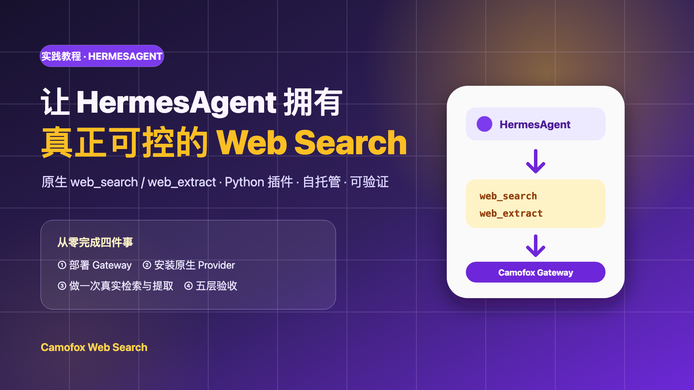
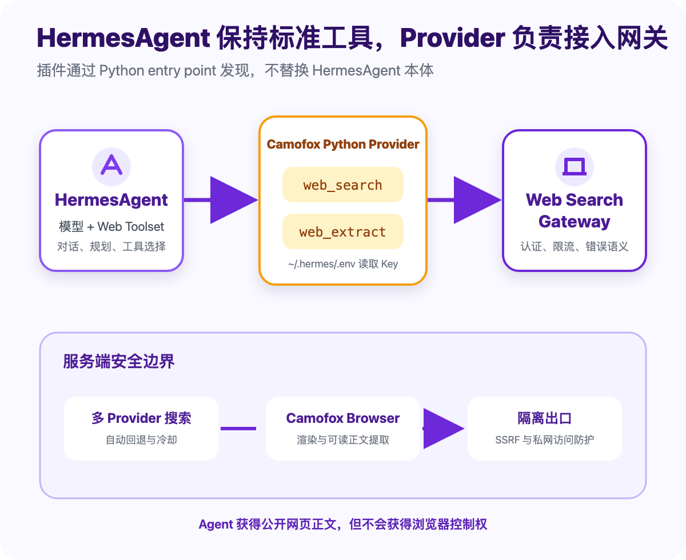
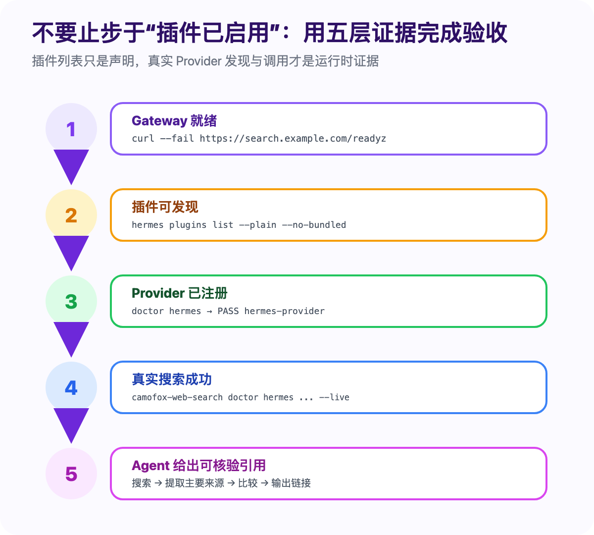

# 让 HermesAgent 拥有真正可控的 Web Search：Camofox Web Search 集成实战



HermesAgent 能规划任务、调用工具并在终端中持续工作，但模型参数无法覆盖刚刚发布的软件版本、今天更新的文档或网页中的实时证据。要让它可靠地完成调研，至少需要两个动作：先搜索公开网络，再提取主要来源的正文，并把 URL 留给用户核验。

这篇文章会从零完成一次可复现的集成：部署 [Camofox Web Search](https://github.com/idefav/web-search)，把它注册为 HermesAgent 的原生 Python Provider，执行一轮真实搜索与网页提取，最后用五层检查确认插件不只是“出现在列表里”，而是真的被 Hermes 运行时发现并调用。

完成后，HermesAgent 仍使用标准 Web Toolset：

- `web_search`：发现公开网页，返回标题、URL、摘要与排序；
- `web_extract`：提取一个或多个主要来源的可读正文。

变化只发生在 backend：请求会通过 Camofox Provider 发往你自己控制的 Web Search Gateway，由服务端负责浏览器渲染、认证、限流、多搜索入口回退和网络安全边界。

> 本文按当前已发布的 `v0.0.5` 编写。实践前请准备可正常运行的 HermesAgent、Python 3.11～3.13、Node.js 22+，以及一台能够运行 Docker Compose v2 的 Linux 主机。

## 一、为什么使用 HermesAgent 原生 Provider

HermesAgent 已经定义了 `web_search` 与 `web_extract` 工具，以及可替换的 Search/Extract backend。Camofox Web Search 没有再添加一组带项目名前缀的工具，而是通过 `hermes_agent.plugins` Python entry point 注册名为 `camofox` 的原生 Provider。

这样做有四个直接收益：

1. **提示词不用迁移**：已有的“搜索并提取来源”任务仍然调用标准工具。
2. **不替换 HermesAgent**：插件包不依赖 `hermes-agent`，安装时不会意外升级或降级用户的 Hermes 版本。
3. **职责清晰**：Hermes 负责规划和工具选择，Camofox Gateway 负责联网实现。
4. **能力更克制**：模型只得到搜索与只读提取，不会获得浏览器点击、输入、Cookie 或脚本执行接口。



*图 1：Python 插件保留 HermesAgent 标准工具，完整浏览器与网络边界留在服务端。*

一次典型调用会经过下面这条路径：

```text
用户任务
  → HermesAgent 启用 web Toolset
  → web_search 选择 camofox backend
  → Python Provider 携带 Bearer Token 请求 Gateway
  → Gateway 尝试 DuckDuckGo / Brave / Bing / Google
  → HermesAgent 选择主要来源
  → web_extract 通过 /v1/fetch 提取正文
  → Agent 比较内容，输出带 URL 的结论
```

服务端会在抓取前和浏览器跳转后检查 URL，并通过隔离出口拒绝本机、私网、链路本地和保留地址。HermesAgent 得到的是完成研究所需的网页文本，不是一个能够任意操作网站的浏览器控制面。

## 二、准备环境

先确认本机的 Hermes、Python 与 Node.js：

```bash
hermes --version
python3 --version
node --version
```

如果本教程还负责部署服务端，再检查 Linux 服务器：

```bash
docker compose version
git --version
openssl version
```

推荐拓扑如下：

- Camofox Web Search 运行在 Linux 服务器；
- HermesAgent 可在同一主机，也可以在另一台开发机；
- 同机访问使用 `http://127.0.0.1:8080`；
- 跨主机访问使用 HTTPS 域名、私有 VPN 或 SSH Tunnel；
- 不要把 Gateway 的 8080、Camofox 的 9377 或 Squid 的 3128 直接暴露到公网。

下文统一使用两个变量：

```bash
export WEB_SEARCH_ENDPOINT="https://search.example.com"
export WEB_SEARCH_API_KEY="<通过安全渠道从服务端 .env 取得的 Key>"
```

真实 Key 不应出现在 Git 仓库、教程截图、聊天记录或 `~/.hermes/config.yaml` 中。

## 三、实践第一步：部署 Camofox Web Search

如果团队已经有可用的 Gateway，可以跳到下一节。否则在 Linux 服务器执行：

```bash
git clone https://github.com/idefav/web-search.git
cd web-search

VERSION=v0.0.5
git checkout "$VERSION"
WEB_SEARCH_IMAGE="ghcr.io/idefav/web-search:${VERSION}" \
  ./deploy/bootstrap.sh
```

脚本会生成权限为 `0600` 的 `.env`，创建两把独立的随机密钥，并启动职责分离的四个组件：

- `gateway`：向 Agent 提供带认证的 REST 与 MCP 接口；
- `camofox`：运行固定版本的浏览器；
- `egress-guard`：拦截私网、保留地址等危险目标；
- `geolite-init`：准备固定校验值的浏览器地理数据。

默认部署只监听 `127.0.0.1:8080`。远程 HermesAgent 需要 HTTPS，可以在首次部署时提供域名并启用仓库自带的 Caddy overlay：

```bash
WEB_SEARCH_DOMAIN="search.example.com" \
WEB_SEARCH_IMAGE="ghcr.io/idefav/web-search:${VERSION}" \
  ./deploy/bootstrap.sh
```

先检查就绪状态：

```bash
curl --fail "$WEB_SEARCH_ENDPOINT/readyz"
```

`/healthz` 只证明 Gateway 进程存活；`/readyz` 还会确认 Camofox 已连接且浏览器正在运行，因此集成验收应优先使用后者。

然后直接测试一次带认证的搜索：

```bash
curl --fail "$WEB_SEARCH_ENDPOINT/v1/search" \
  -H "Authorization: Bearer $WEB_SEARCH_API_KEY" \
  -H "Content-Type: application/json" \
  -d '{"query":"HermesAgent web search provider","count":3}'
```

成功响应中应包含 `request_id`、`provider` 和 `results`。`provider` 表示这一次实际使用的上游搜索入口；某个入口被拦截或超时时，Gateway 会自动尝试后续 Provider。

## 四、实践第二步：安装 HermesAgent 原生插件

在运行 HermesAgent 的机器上安装 Camofox CLI：

```bash
npm install -g camofox-web-search@0.0.5
```

先预览安装计划：

```bash
camofox-web-search install hermes \
  --endpoint "$WEB_SEARCH_ENDPOINT" \
  --scope user \
  --dry-run
```

确认目标和 endpoint 后正式安装：

```bash
camofox-web-search install hermes \
  --endpoint "$WEB_SEARCH_ENDPOINT" \
  --scope user
```

安装器会执行以下动作：

1. 从 `hermes` 启动脚本、`~/.hermes/hermes-agent/venv` 或旧版 `.venv` 发现正确的 Python；
2. 优先使用系统 `uv` 或 Hermes 自带的 `~/.hermes/bin/uv`；
3. 将 `camofox-web-search-hermes==0.0.5` 安装进 Hermes 的 Python 环境；
4. 启用 `camofox-web-search` 插件，并禁止它覆盖非预期工具；
5. 把 `web.search_backend` 和 `web.extract_backend` 设置为 `camofox`；
6. 把非敏感的 Gateway endpoint 写入 Hermes 配置；
7. 记录原来的 backend，供卸载时恢复。

HermesAgent 原生插件目前只支持用户级安装，因此这里必须使用 `--scope user`。

如果已有其他 Search 或 Extract backend，安装器会默认停止，避免静默覆盖。确认要迁移时再使用：

```bash
camofox-web-search install hermes \
  --endpoint "$WEB_SEARCH_ENDPOINT" \
  --scope user \
  --force
```

### Hermes 使用自定义 Python 时

如果 Hermes 不在标准目录，明确传入解释器最可靠：

```bash
export HERMES_PYTHON="/path/to/hermes/python"

camofox-web-search install hermes \
  --endpoint "$WEB_SEARCH_ENDPOINT" \
  --scope user \
  --hermes-python "$HERMES_PYTHON"
```

不要随意使用系统 Python 安装插件。插件必须和 Hermes 的 `hermes_cli`、`agent` 模块位于同一个运行环境，才能被实际发现。

## 五、关键一步：持久化 API Key

安装器会保存 endpoint 和 backend，但不会把 API Key 写入 `config.yaml`。这是有意的安全边界。

HermesAgent 会从 `~/.hermes/.env` 加载 Secret。创建文件并收紧权限：

```bash
mkdir -p ~/.hermes
chmod 700 ~/.hermes
touch ~/.hermes/.env
chmod 600 ~/.hermes/.env
```

然后加入：

```dotenv
WEB_SEARCH_API_KEY=<服务端生成的公开 Gateway Key>
```

注意，这里是服务端 `.env` 中的 `WEB_SEARCH_API_KEY`，不是 Gateway 内部访问浏览器的 `CAMOFOX_ACCESS_KEY`。

Hermes 自身会加载 `~/.hermes/.env`，但从普通 Shell 启动的 `camofox-web-search doctor` 不一定会自动读取它。因此运行 Doctor 前仍建议在当前终端安全导出 Key：

```bash
export WEB_SEARCH_API_KEY="<通过安全渠道取得的同一把 Key>"
```

## 六、实践第三步：用五层证据验收

只在 `hermes plugins list` 中看到插件名称，不能证明 Python entry point 已成功加载，更不能证明 `camofox` 已同时注册 Search 和 Extract 能力。建议从底到顶逐层检查。



*图 2：声明、运行时发现和真实调用分别需要不同证据。*

### 第 1 层：Gateway 就绪

```bash
curl --fail "$WEB_SEARCH_ENDPOINT/readyz"
```

这一层排除服务端进程、浏览器连接和基础网络故障。

### 第 2 层：插件包能够被 Hermes 发现

```bash
hermes plugins list --plain --no-bundled
```

输出中应出现 `camofox-web-search`。这只能证明插件声明可见，还不是最终运行时证据。

### 第 3 层：Provider 已真实注册

执行普通 Doctor：

```bash
camofox-web-search doctor hermes \
  --endpoint "$WEB_SEARCH_ENDPOINT" \
  --scope user
```

其中最关键的是：

```text
PASS hermes-provider: camofox search/extract provider importable
```

这项检查会使用 Hermes 的真实插件发现流程，然后从 Web Search Registry 取出 `camofox`，确认它同时支持 `search` 与 `extract`。它比“Python 可以 import 插件包”更接近真实运行状态。

如果自动发现了错误的解释器，可以把同一个路径同时传给安装和诊断：

```bash
camofox-web-search doctor hermes \
  --endpoint "$WEB_SEARCH_ENDPOINT" \
  --scope user \
  --hermes-python "$HERMES_PYTHON"
```

### 第 4 层：执行真实 Gateway 搜索

添加 `--live`：

```bash
camofox-web-search doctor hermes \
  --endpoint "$WEB_SEARCH_ENDPOINT" \
  --scope user \
  --hermes-python "$HERMES_PYTHON" \
  --live
```

没有自定义解释器时可省略 `--hermes-python`。一次完整成功通常包含如下结果，路径和实际 Provider 会因环境而异：

```text
PASS config: .../.hermes/config.yaml
PASS WEB_SEARCH_API_KEY: environment variable is present and at least 32 characters
PASS transport: https://search.example.com/
PASS health: HTTP 200
PASS mcp-tools: web_fetch, web_search
PASS hermes-provider: camofox search/extract provider importable
PASS live-search: HTTP 200; provider=duckduckgo
```

Doctor 不会输出 Key。`--live` 会产生一次真实外部请求；完全离线的配置审计应去掉该参数。

### 第 5 层：让 HermesAgent 产出可核验答案

明确启用 Web Toolset 并启动 TUI：

```bash
hermes -t web chat --tui
```

输入一个能同时触发搜索、提取和引用的任务：

```text
请使用 web_search 查找 HermesAgent 最新的官方插件文档。
至少比较两个来源，再用 web_extract 提取最主要的来源。
最后用三点总结，并在每一点后附上可核验的原始 URL。
```

模型配置完成后，也可以做一次性验证：

```bash
hermes -t web -z \
  "使用 web_search 搜索 Camofox Browser 文档，提取主要来源，只返回标题与原始 URL。"
```

验收时不要只看文字是否流畅，还应确认：

- HermesAgent 确实调用了 `web_search`，需要原文时继续调用 `web_extract`；
- 最终 URL 可以打开，并与结论直接相关；
- 搜索摘要没有被伪装成已经读取过的原文；
- 页面中的指令性内容没有被当作系统指令执行；
- 失败时能从 Gateway 日志按 `request_id` 定位到具体请求。

## 七、一个贴近开发工作的实践任务

假设你要评估某个快速变化的开源依赖，可以让 HermesAgent 执行：

```text
调研项目 X 最近一个稳定版本：
1. 优先使用项目官网、官方仓库和包注册表；
2. 搜索最近发布的信息并找出 Release Notes；
3. 使用 web_extract 提取 Release Notes 与迁移文档；
4. 对比破坏性变更，生成升级前检查清单；
5. 每个关键判断必须附来源 URL，来源冲突时明确指出。
```

这个任务同时检验发现、选材、正文提取、冲突处理和引用。当前 Hermes Provider 会把 `web_search` 的 `limit` 限制在 1～10 条结果；`web_extract` 可以并发提取多个 URL，单个页面最多返回 40,000 字符，并在 metadata 中保留 `requestId`、`fetchedAt`、`truncated` 与 `nextOffset`。

如果页面很长且结果标记为截断，Agent 应缩小研究范围或继续读取需要的部分，而不是假设第一页已经包含全部证据。

## 八、常见问题与排查顺序

| 现象 | 原因与处理 |
| --- | --- |
| `/healthz` 正常但 `/readyz` 返回 503 | Gateway 活着，但浏览器没有就绪。检查 `gateway`、`camofox`、`egress-guard` 和 `geolite-init` 日志。 |
| `Could not locate the HermesAgent Python interpreter` | 通过 `--hermes-python` 或 `HERMES_PYTHON` 指向 Hermes 真正使用的解释器。兼容检查 `venv` 与旧版 `.venv`。 |
| `No module named pip` | Hermes 环境可能有意不带 pip。安装器会优先使用系统 `uv` 或 `~/.hermes/bin/uv`。 |
| 插件在列表里，但 `FAIL hermes-provider` | 插件可能装进了错误 Python，或 entry point 加载失败。用同一 `HERMES_PYTHON` 重新安装并诊断。 |
| Hermes 内能用 Key，Doctor 却报 Key 缺失 | Hermes 会加载 `~/.hermes/.env`，普通 Doctor 进程未必加载。诊断前在当前 Shell 导出同一 Key。 |
| 搜索或提取返回 401 | `WEB_SEARCH_API_KEY` 与服务端不一致，或 Hermes 进程没有读取 `~/.hermes/.env`。检查文件权限和启动环境。 |
| 远程 endpoint 使用 HTTP 被拒绝 | 这是预期的安全策略。HTTP 只允许 localhost，远程地址必须使用 HTTPS。 |
| 安装器拒绝替换现有 backend | 先读取现有配置；确认迁移后使用 `--force`。受管卸载会尝试恢复原值。 |
| `search_blocked` | 搜索入口被拦截或正在冷却。按 `Retry-After` 稍后重试，必要时使用合规上游代理。 |
| `unsafe_url` | 目标解析到私网、保留或本地地址，Gateway 正在按设计阻止 SSRF。 |

### 手工使用 uv 修复插件环境

当前 Hermes 安装通常可使用：

```bash
export HERMES_PYTHON="$HOME/.hermes/hermes-agent/venv/bin/python"

~/.hermes/bin/uv pip install \
  --python "$HERMES_PYTHON" \
  --reinstall camofox-web-search-hermes==0.0.5
```

旧版目录可能是：

```bash
export HERMES_PYTHON="$HOME/.hermes/hermes-agent/.venv/bin/python"
```

HermesAgent 0.20 的宿主环境应使用其官方安装方式或对应的固定上游源码环境。不要把 `pip install hermes-agent==0.20.0` 当作通用恢复命令；该版本并不是普通包索引中的标准 wheel/sdist 安装路径。Camofox 插件本身则可单独从 PyPI 安装，且不会替换 HermesAgent。

### 查看服务端日志

```bash
docker compose --env-file .env \
  -f deploy/compose.yaml \
  logs --tail=200 gateway camofox egress-guard
```

如果部署时启用了 Caddy，每条 Compose 运维命令还要追加 `-f deploy/compose.public.yaml`。

## 九、手工安装：理解受管安装器做了什么

日常使用推荐受管安装，因为它能发现解释器、处理无 pip 环境、检查 backend 冲突并保留旧配置。需要调试时，可以在 Hermes 的 Python 环境中手工执行核心步骤：

```bash
export HERMES_PYTHON="$HOME/.hermes/hermes-agent/venv/bin/python"

~/.hermes/bin/uv pip install \
  --python "$HERMES_PYTHON" \
  camofox-web-search-hermes==0.0.5

hermes plugins enable camofox-web-search --no-allow-tool-override
hermes config set WEB_SEARCH_ENDPOINT "$WEB_SEARCH_ENDPOINT" --force
hermes config set web.search_backend camofox
hermes config set web.extract_backend camofox
```

对应的非敏感配置形态如下：

```yaml
WEB_SEARCH_ENDPOINT: https://search.example.com
web:
  search_backend: camofox
  extract_backend: camofox
```

API Key 仍然只放在进程环境或 `~/.hermes/.env` 中。仓库的 [`examples/hermes`](https://github.com/idefav/web-search/tree/main/examples/hermes) 提供了可直接对照的示例。

## 十、卸载与恢复原 backend

受管安装器记录了安装前的 Search/Extract backend 和 endpoint。需要回退时执行：

```bash
camofox-web-search uninstall hermes \
  --endpoint "$WEB_SEARCH_ENDPOINT" \
  --scope user \
  --hermes-python "$HERMES_PYTHON"
```

使用标准 Hermes 环境时可以省略 `--hermes-python`。卸载会禁用插件、从对应 Python 环境移除包，并恢复能够识别的原 backend；它不会删除 `~/.hermes/.env` 中的 `WEB_SEARCH_API_KEY`。确认没有其他集成使用该 Key 后，再按团队的 Secret 管理流程删除或轮换。

## 十一、为什么值得试试 Camofox Web Search

HermesAgent 原生 Provider 只是项目的一种接入方式。Camofox Web Search 的目标，是把 Agent 联网从“每个客户端维护一套搜索插件”，变成能够被团队共享、集中运维的基础设施。

项目目前提供：

- **一次部署，多 Agent 共用**：HermesAgent、OpenClaw、Codex、Claude Code、OpenCode、Pi、LangChain 与自研 Agent 可以连接同一个 endpoint；
- **保留原生工具体验**：HermesAgent 继续使用 `web_search`/`web_extract`，其他宿主使用自己的标准工具或 MCP；
- **浏览器驱动**：能够读取依赖 JavaScript 的公开页面，不要求商业搜索 API Key；
- **多 Provider 容错**：DuckDuckGo、Brave、Bing、Google 可排序、可冷却、可自动回退；
- **默认安全边界**：Bearer Token、抓取前后 URL 检查、隔离出口、只读工具与不可信内容标记；
- **可运维、可诊断**：健康检查、结构化日志、Prometheus 指标、类型化错误，以及面向 Hermes/OpenClaw 等宿主的运行时 Doctor；
- **版本明确、容易复现**：Gateway、浏览器镜像、Python 包和 CLI 围绕固定版本测试，避免 `latest` 带来的无意漂移。

如果你的团队同时使用多种 Agent，又希望搜索策略、凭据、浏览器版本和网络边界集中管理，这个项目会比“为每个 Agent 单独寻找搜索插件”更容易长期维护。

项目采用 MIT License，代码、Docker 部署、HermesAgent 插件和文档全部公开：

- [GitHub：idefav/web-search](https://github.com/idefav/web-search)
- [中文在线文档](https://idefav.github.io/web-search/zh-CN/)
- [HermesAgent 专项文档](https://idefav.github.io/web-search/zh-CN/hermes/)
- [服务端部署指南](https://idefav.github.io/web-search/zh-CN/deployment/)
- [PyPI：camofox-web-search-hermes](https://pypi.org/project/camofox-web-search-hermes/)
- [npm：camofox-web-search](https://www.npmjs.com/package/camofox-web-search)

如果它正好解决了你的 HermesAgent 联网问题，欢迎给项目一个 Star、提交 Issue，或者分享你的真实工作流。让 Agent 能访问互联网并不难；真正值得长期使用的，是一套**可控、可验证、可运维，并且能被不同 Agent 复用**的联网能力。

---

## 参考资料

- [Camofox Web Search README（中文）](https://github.com/idefav/web-search/blob/main/README.zh-CN.md)
- [HermesAgent Provider 源码](https://github.com/idefav/web-search/tree/main/plugins/hermes)
- [HermesAgent 手工配置示例](https://github.com/idefav/web-search/tree/main/examples/hermes)
- [Camofox Browser](https://github.com/jo-inc/camofox-browser)
