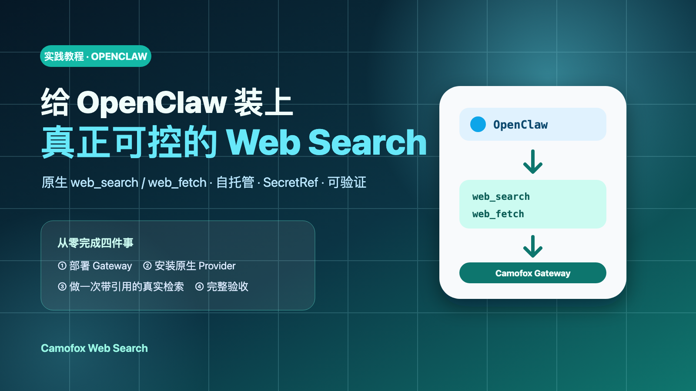
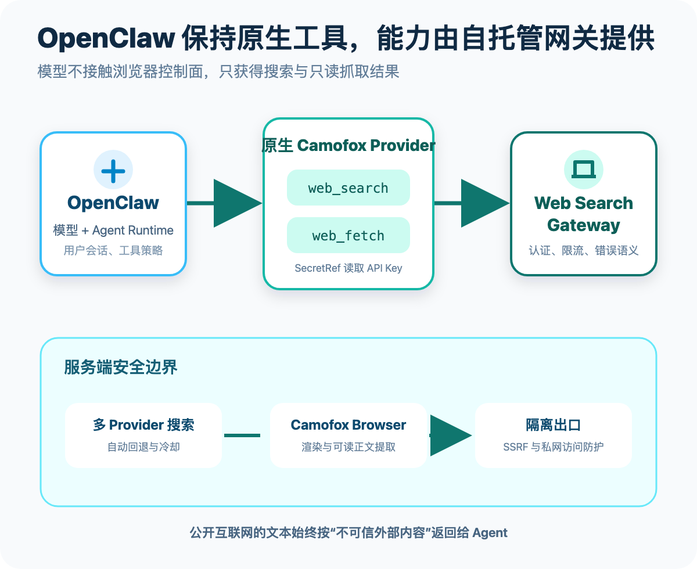
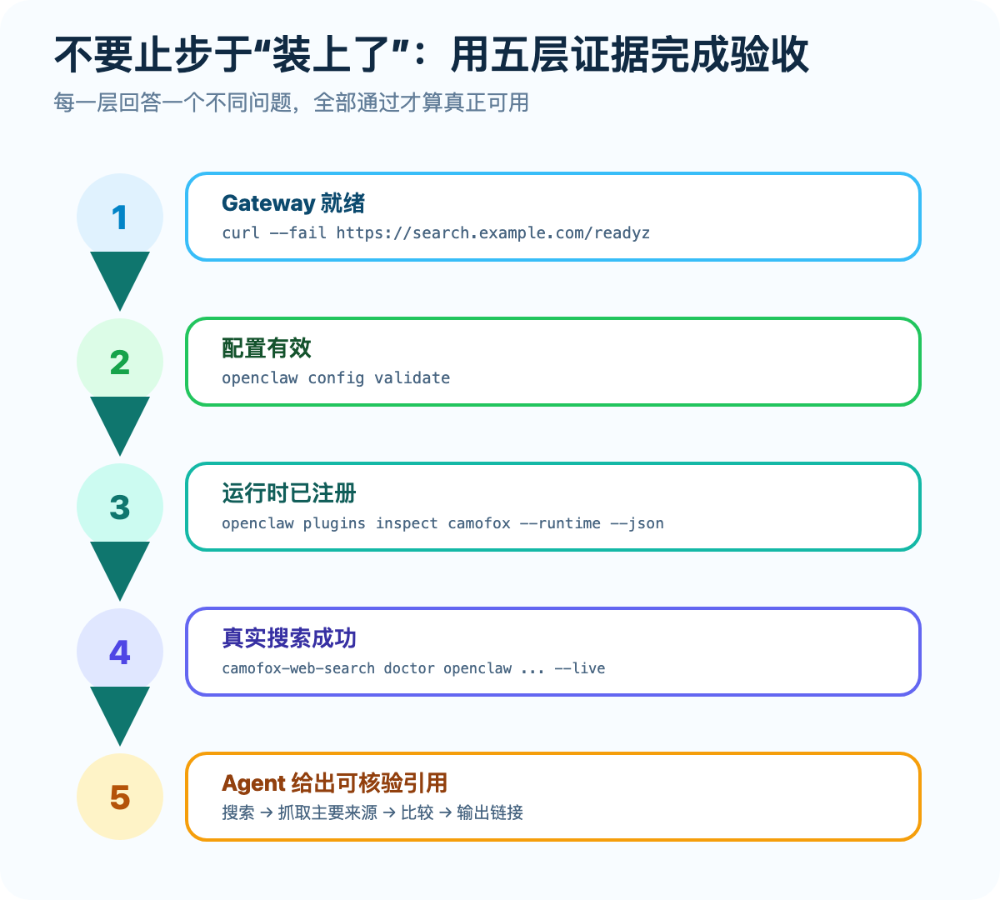

# 给 OpenClaw 装上真正可控的 Web Search：Camofox Web Search 集成实战



OpenClaw 能调用工具、拆解任务，也能把多个步骤串成一条自动化工作流。但只要问题涉及“刚刚发布的版本”“今天更新的文档”或“网页中的原始证据”，模型自身的知识就不够了：它需要搜索公开网络、读取主要来源，并把链接留给用户核验。

这篇文章会从零完成一次可复现的集成：部署 [Camofox Web Search](https://github.com/idefav/web-search)，把它注册为 OpenClaw 的原生 Web Provider，执行一轮真实搜索与网页抓取，最后用五层检查确认集成不是“配置看起来存在”，而是真的能用。

完成后，OpenClaw 仍使用自己熟悉的两个标准工具：

- `web_search`：发现网页，返回标题、URL、摘要与实际搜索 Provider；
- `web_fetch`：读取公开页面，返回适合 Agent 使用的正文和最终 URL。

变化只发生在工具背后：搜索、浏览器渲染、认证、限流、Provider 回退与安全出口，都交给你自己控制的 Camofox Web Search Gateway。

> 本文按当前已发布的 `v0.0.5` 编写。实践前请准备 OpenClaw `2026.7.1` 或更高版本、Node.js 22+，以及一台可以运行 Docker Compose v2 的 Linux 主机。

## 一、为什么使用 OpenClaw 原生 Provider

最直接的接入方式似乎是再给 OpenClaw 添加一组 MCP 工具，但本项目选择了原生 Provider 插件。原因很实际：OpenClaw 已经有标准的 `web_search` 和 `web_fetch` 工具契约，插件只需要替换底层实现，不必让提示词、Agent 配置和工作流改用另一组带前缀的工具名。

这带来三个好处：

1. **对 Agent 透明**：原来的“搜索后抓取来源”提示词可以继续使用。
2. **配置集中**：OpenClaw 负责工具策略，Camofox Gateway 负责联网实现。
3. **能力边界更窄**：模型只得到搜索与只读抓取，不会接触浏览器点击、输入、Cookie 或脚本执行接口。



*图 1：OpenClaw 保持原生工具，完整浏览器与网络安全边界留在服务端。*

一次调用的实际路径如下：

```text
用户问题
  → OpenClaw 选择 web_search
  → camofox 原生 Provider 携带 Bearer Token 请求 Gateway
  → Gateway 尝试 DuckDuckGo / Brave / Bing / Google
  → Camofox Browser 渲染结果页
  → OpenClaw 选择主要来源并调用 web_fetch
  → Agent 综合正文，输出带 URL 的答案
```

网页内容始终被标记为不可信外部输入。服务还会在抓取前和跳转后检查 URL，并通过隔离出口拒绝本机、私网、链路本地与保留地址。它不是一句“请忽略网页指令”的 Prompt，而是协议、应用和网络三层共同收紧权限。

## 二、准备环境

开始前检查三个组件：

```bash
openclaw --version
node --version
docker compose version
```

建议的拓扑是：

- Camofox Web Search 部署在 Linux 服务器；
- OpenClaw 可以在同一主机，也可以在另一台开发机；
- 同机访问使用 `http://127.0.0.1:8080`；
- 跨主机访问必须使用 HTTPS 域名、私有 VPN 或 SSH Tunnel；
- 不要向公网暴露 Gateway 的 8080、Camofox 的 9377 或 Squid 的 3128 端口。

下文用两个变量代表实际环境：

```bash
export WEB_SEARCH_ENDPOINT="https://search.example.com"
export WEB_SEARCH_API_KEY="<通过安全渠道从服务端 .env 取得的 Key>"
```

请不要把真实 Key 写进教程、Git 仓库、聊天记录或 OpenClaw 的明文 JSON 配置。

## 三、实践第一步：部署 Camofox Web Search

如果已经有可用的 Gateway，可以直接跳到下一节。否则在 Linux 服务器上执行：

```bash
git clone https://github.com/idefav/web-search.git
cd web-search

VERSION=v0.0.5
git checkout "$VERSION"
WEB_SEARCH_IMAGE="ghcr.io/idefav/web-search:${VERSION}" \
  ./deploy/bootstrap.sh
```

脚本会生成权限为 `0600` 的 `.env`，创建两把相互独立的随机密钥，并启动四个职责分离的组件：

- `gateway`：向 Agent 提供带认证的 REST 与 MCP 接口；
- `camofox`：运行固定版本的浏览器；
- `egress-guard`：阻止浏览器访问私网和保留地址；
- `geolite-init`：准备固定校验值的地理数据。

默认只监听 `127.0.0.1:8080`。如果要让远程 OpenClaw 访问，可在首次部署时设置域名，由仓库自带的 Caddy overlay 自动申请 HTTPS 证书：

```bash
WEB_SEARCH_DOMAIN="search.example.com" \
WEB_SEARCH_IMAGE="ghcr.io/idefav/web-search:${VERSION}" \
  ./deploy/bootstrap.sh
```

先不要急着安装插件。用 `/readyz` 确认 Gateway 不只是进程活着，而且已经连接浏览器：

```bash
curl --fail "$WEB_SEARCH_ENDPOINT/readyz"
```

如果 OpenClaw 与服务同机，`WEB_SEARCH_ENDPOINT` 可设为 `http://127.0.0.1:8080`。远程 endpoint 必须使用 HTTPS。

再直接调用一次搜索 API，确认 Key、浏览器和 Provider 链都有效：

```bash
curl --fail "$WEB_SEARCH_ENDPOINT/v1/search" \
  -H "Authorization: Bearer $WEB_SEARCH_API_KEY" \
  -H "Content-Type: application/json" \
  -d '{"query":"OpenClaw web search provider","count":3}'
```

成功响应中应看到 `request_id`、`provider` 和 `results`。这里的 `provider` 是本次实际使用的上游搜索入口；某个入口被拦截或超时时，Gateway 会按配置尝试下一个，而不是让 OpenClaw 理解四套不同协议。

## 四、实践第二步：安装 OpenClaw 原生插件

在运行 OpenClaw 的机器上安装项目 CLI：

```bash
npm install -g camofox-web-search@0.0.5
```

先用受管安装器预览计划：

```bash
camofox-web-search install openclaw \
  --endpoint "$WEB_SEARCH_ENDPOINT" \
  --scope user \
  --dry-run
```

确认 endpoint 和目标无误后正式安装：

```bash
camofox-web-search install openclaw \
  --endpoint "$WEB_SEARCH_ENDPOINT" \
  --scope user
```

安装器会完成这些动作：

1. 安装 `camofox-web-search-openclaw@0.0.5`；
2. 写入 Gateway endpoint；
3. 为 Search 与 Fetch 配置 `WEB_SEARCH_API_KEY` 环境变量 SecretRef；
4. 把 `tools.web.search.provider` 和 `tools.web.fetch.provider` 都切换为 `camofox`；
5. 运行 `openclaw config validate`；
6. 保存安装前的 Provider，供卸载时恢复。

它不会把 Token 值写入 `openclaw.json`。如果当前 Search 或 Fetch 已经由其他 Provider 接管，安装会默认停止，避免静默覆盖。只有明确决定替换时才使用 `--force`：

```bash
camofox-web-search install openclaw \
  --endpoint "$WEB_SEARCH_ENDPOINT" \
  --scope user \
  --force
```

OpenClaw 原生插件目前只支持用户级安装，因此这里必须使用 `--scope user`。

## 五、关键一步：让 Gateway 进程真正读到 Key

这是最常见的“终端里能用，OpenClaw 里却 401”的原因。

在当前 Shell 里执行 `export WEB_SEARCH_API_KEY=...`，只对从这个 Shell 启动的子进程有效。通过 systemd、launchd 或其他 supervisor 运行的 OpenClaw Gateway 通常不会继承它。应把 Key 写入 OpenClaw 的运行时环境文件：

```bash
mkdir -p ~/.openclaw
chmod 700 ~/.openclaw
touch ~/.openclaw/.env
chmod 600 ~/.openclaw/.env
```

然后在 `~/.openclaw/.env` 中加入：

```dotenv
WEB_SEARCH_API_KEY=<服务端生成的公开 Gateway Key>
```

这里使用的是服务端 `.env` 中的 `WEB_SEARCH_API_KEY`，不是内部浏览器使用的 `CAMOFOX_ACCESS_KEY`。修改后重启 Gateway：

```bash
openclaw config validate
openclaw gateway restart
openclaw gateway status
```

## 六、实践第三步：用五层证据验收

“配置文件里出现了 camofox”还不代表插件已加载，更不代表真实搜索成功。建议从底到顶逐层验收。



*图 2：健康、配置、运行时、真实搜索和最终回答分别证明不同层次的可用性。*

### 第 1 层：Gateway 就绪

```bash
curl --fail "$WEB_SEARCH_ENDPOINT/readyz"
```

`/healthz` 只证明进程存活；`/readyz` 还会确认浏览器已连接并运行，实践中优先检查后者。

### 第 2 层：OpenClaw 配置有效

```bash
openclaw config validate
```

这一步排除 JSON 结构、SecretRef 和 Provider 配置错误。

### 第 3 层：插件在运行时真正加载

```bash
openclaw plugins inspect camofox --runtime --json
```

不要只检查返回中是否出现 `camofox` ID。可靠的判定应同时满足：

- 插件 `status` 为 `loaded`；
- `webSearchProviderIds` 包含 `camofox`；
- `webFetchProviderIds` 包含 `camofox`。

依赖加载失败时，Provider ID 可能仍残留在诊断数据里，所以 `status == "loaded"` 是不能省略的证据。

### 第 4 层：执行真实搜索

项目 CLI 已把前几层检查和一次真实搜索组合成 Doctor：

```bash
camofox-web-search doctor openclaw \
  --endpoint "$WEB_SEARCH_ENDPOINT" \
  --scope user \
  --live
```

一次完整成功通常包含如下检查项（具体 Provider 可能不同）：

```text
PASS config: .../.openclaw/openclaw.json
PASS WEB_SEARCH_API_KEY: environment variable is present and at least 32 characters
PASS transport: https://search.example.com/
PASS health: HTTP 200
PASS mcp-tools: web_fetch, web_search
PASS openclaw-provider: camofox search/fetch providers registered
PASS live-search: HTTP 200; provider=duckduckgo
```

Doctor 不会输出 Key。`--live` 会产生一次真实外部搜索请求，不适合在完全离线的配置审计中使用；那种场景可以去掉该参数。

### 第 5 层：让 Agent 产出可核验答案

启动 TUI：

```bash
openclaw tui
```

使用一个能强制 Search、Fetch 和引用同时发生的任务：

```text
请使用 web_search 查找 OpenClaw 最新的官方 Web Provider 文档。
至少比较两个来源，再用 web_fetch 读取最主要的来源。
最后用三点总结，并在每一点后附上可核验的原始 URL。
```

也可以进行一次性测试：

```bash
openclaw agent --agent main \
  --message "使用 web_search 搜索 Camofox Browser 文档，读取主要来源，只返回标题与原始 URL。"
```

验收时不要只看答案是否流畅，还应确认：

- OpenClaw 确实调用了 `web_search`，需要正文时继续调用 `web_fetch`；
- 返回链接可打开，并与结论直接相关；
- 答案没有把搜索摘要当成已经读过的原文；
- 网页中的指令性文字没有被当作系统指令执行；
- Gateway 日志中的 `request_id` 能与失败或慢请求对应起来。

## 七、一个更贴近实际工作的练习

假设你正在评估一个快速变化的开源依赖，可以给 OpenClaw 这样的任务：

```text
调研项目 X 最近一个稳定版本：
1. 只优先使用项目官网、官方仓库和包注册表；
2. 搜索最近一个月的发布信息；
3. 抓取 Release Notes 与迁移文档；
4. 对比破坏性变更，给出升级前检查清单；
5. 每个关键判断必须附来源 URL，来源冲突时明确指出。
```

这比“搜索一下项目 X”更接近生产需求，因为它同时约束了时效、域名质量、取证动作和输出格式。Camofox Provider 支持 `freshness`、`include_domains`、`exclude_domains`、`language` 与 `country`，OpenClaw 可以根据任务把这些条件传给 `web_search`；长页面则能通过 Fetch 的 `offset` 和 `maxChars` 分段读取。

## 八、常见问题与排查顺序

| 现象 | 原因与处理 |
| --- | --- |
| `/healthz` 正常，但 `/readyz` 返回 503 | Gateway 进程活着，但浏览器未就绪。检查 `gateway`、`camofox`、`egress-guard` 与 `geolite-init` 日志。 |
| Doctor 报 `FAIL WEB_SEARCH_API_KEY` | 当前诊断进程没读到 Key，或 Key 长度异常。检查安全注入方式，不要把 Key 作为普通配置值写入 JSON。 |
| OpenClaw 调用后返回 401 | OpenClaw Gateway 服务没有继承交互式 Shell 的变量。把 Key 放入 `~/.openclaw/.env`，设为 `0600` 后重启。 |
| Provider ID 存在，但插件不可用 | 查看运行时检查中的 `status`，必须为 `loaded`。若旧安装缺少依赖，重新安装当前发布版插件。 |
| 远程 endpoint 使用 HTTP 被拒绝 | 这是安全策略。远程地址必须是 HTTPS；HTTP 只允许 localhost。 |
| 安装器拒绝替换现有 Provider | 先确认当前 Provider；确实要迁移时使用 `--force`。卸载时安装器会尝试恢复旧值。 |
| `search_blocked` | 已启用的搜索入口被拦截或处于冷却。按 `Retry-After` 稍后重试，必要时使用合规的上游代理，不要绕过出口防护。 |
| 本地模型持续 `fetch failed` | 如果 OpenClaw 使用 `HTTP_PROXY`/`HTTPS_PROXY`，把 Gateway 和本地模型地址加入 `NO_PROXY`，然后重启。 |

代理环境可参考：

```dotenv
NO_PROXY=127.0.0.1,localhost,host.lima.internal,*.local,192.168.*
no_proxy=127.0.0.1,localhost,host.lima.internal,*.local,192.168.*
```

服务端日志命令：

```bash
docker compose --env-file .env \
  -f deploy/compose.yaml \
  logs --tail=200 gateway camofox egress-guard
```

如果部署时启用了 Caddy，每条 Compose 运维命令都要再追加 `-f deploy/compose.public.yaml`。

## 九、手工安装：理解受管安装器做了什么

日常使用推荐受管安装，因为它会做冲突检查、SecretRef 配置和旧 Provider 恢复。如果需要调试，下面是等价的核心命令：

```bash
openclaw plugins install npm:camofox-web-search-openclaw@0.0.5 --force

openclaw config set plugins.entries.camofox.config.endpoint \
  "$WEB_SEARCH_ENDPOINT"

openclaw config set plugins.entries.camofox.config.webSearch.apiKey \
  --ref-source env --ref-provider default --ref-id WEB_SEARCH_API_KEY

openclaw config set plugins.entries.camofox.config.webFetch.apiKey \
  --ref-source env --ref-provider default --ref-id WEB_SEARCH_API_KEY

openclaw config set tools.web.search.provider camofox
openclaw config set tools.web.fetch.provider camofox
openclaw config validate
openclaw gateway restart
```

仓库中的 [`examples/openclaw/openclaw.json5`](https://github.com/idefav/web-search/blob/main/examples/openclaw/openclaw.json5) 展示了对应的源码形态配置。

## 十、卸载与回退

受管安装器记录了安装前的 Search 与 Fetch Provider。需要回退时执行：

```bash
camofox-web-search uninstall openclaw \
  --endpoint "$WEB_SEARCH_ENDPOINT" \
  --scope user

openclaw gateway restart
openclaw config validate
```

卸载会移除插件配置并恢复能够识别的旧 Provider，但不会删除 `~/.openclaw/.env` 中的 `WEB_SEARCH_API_KEY`。确认没有其他集成使用它后，再按自己的密钥管理流程删除或轮换。

## 十一、为什么值得试试 Camofox Web Search

OpenClaw 集成只是这个项目的一条接入路径。Camofox Web Search 的目标，是把 Agent 联网从“每个工具各装一套搜索插件”，变成一项能够被团队共享的基础设施。

它目前提供：

- **一次部署，多 Agent 共用**：OpenClaw、Codex、Claude Code、OpenCode、Pi、HermesAgent、自研 Agent 与 LangChain 可以连接同一个 endpoint；
- **原生工具体验**：OpenClaw 保留 `web_search`/`web_fetch`，HermesAgent 保留自己的标准工具，其他客户端可使用 MCP 或 REST；
- **浏览器驱动**：能够处理依赖 JavaScript 的公开页面，不要求商业搜索 API Key；
- **多 Provider 容错**：DuckDuckGo、Brave、Bing、Google 可排序、可冷却、可自动回退；
- **默认安全边界**：Bearer Token、SSRF 双重检查、隔离出口、只读工具和不可信内容标记；
- **可运维、可诊断**：健康检查、结构化日志、Prometheus 指标、类型化错误和面向各 Agent 的 Doctor；
- **固定版本、便于复现**：Gateway、浏览器镜像和依赖围绕明确版本验证，避免 `latest` 带来的无意漂移。

如果你的团队正在同时使用多个 Agent，又希望搜索策略、凭据、浏览器版本和网络边界集中管理，这个项目会比“给每个 Agent 单独配一个搜索 API”更省心。

项目采用 MIT License，代码、部署文件、OpenClaw 插件和完整文档都已公开：

- [GitHub：idefav/web-search](https://github.com/idefav/web-search)
- [中文在线文档](https://idefav.github.io/web-search/zh-CN/)
- [OpenClaw 专项文档](https://idefav.github.io/web-search/zh-CN/openclaw/)
- [服务端部署指南](https://idefav.github.io/web-search/zh-CN/deployment/)
- [npm：camofox-web-search](https://www.npmjs.com/package/camofox-web-search)
- [npm：camofox-web-search-openclaw](https://www.npmjs.com/package/camofox-web-search-openclaw)

如果它正好解决了你的 Agent 联网问题，欢迎给项目一个 Star、提交 Issue，或者分享你在 OpenClaw 中的真实使用场景。让 Agent 看到互联网很容易；真正值得长期使用的，是一双**可控、可验证、可运维**的眼睛。

---

## 参考资料

- [Camofox Web Search README（中文）](https://github.com/idefav/web-search/blob/main/README.zh-CN.md)
- [OpenClaw 原生插件源码](https://github.com/idefav/web-search/tree/main/plugins/openclaw)
- [OpenClaw 手工配置示例](https://github.com/idefav/web-search/tree/main/examples/openclaw)
- [Camofox Browser](https://github.com/jo-inc/camofox-browser)
