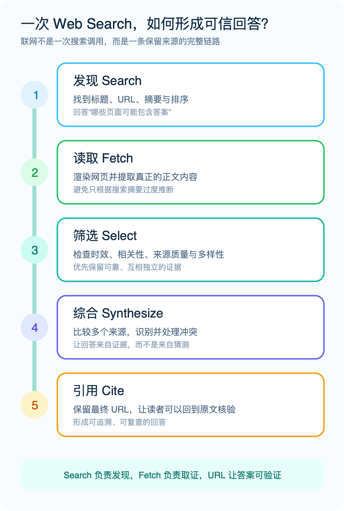
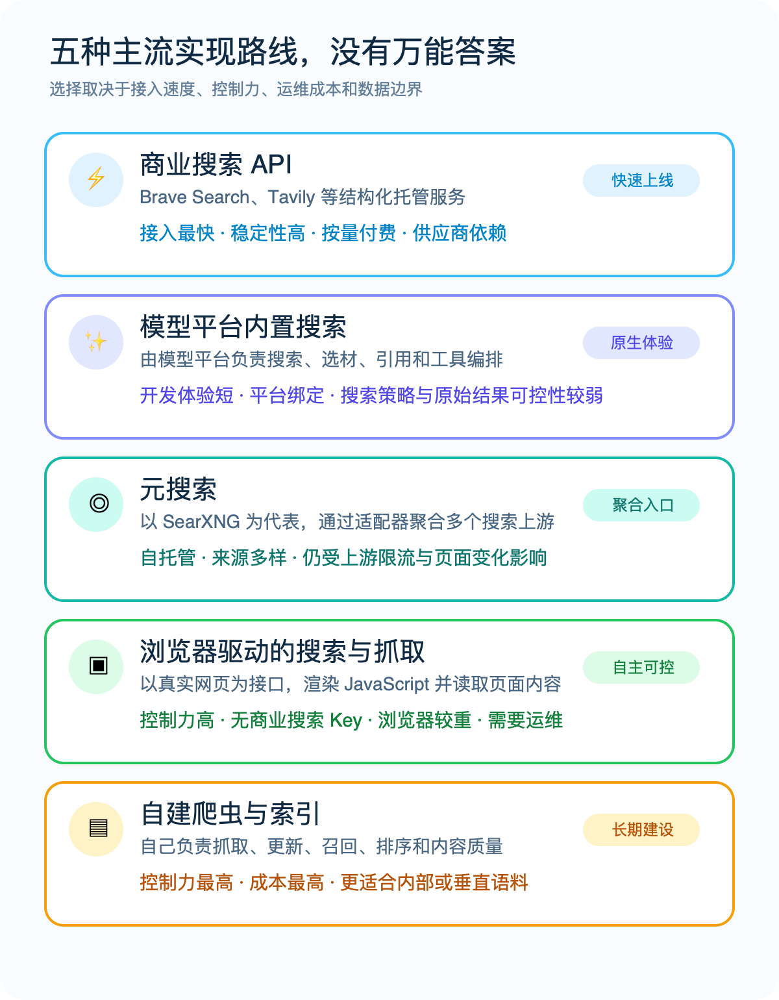
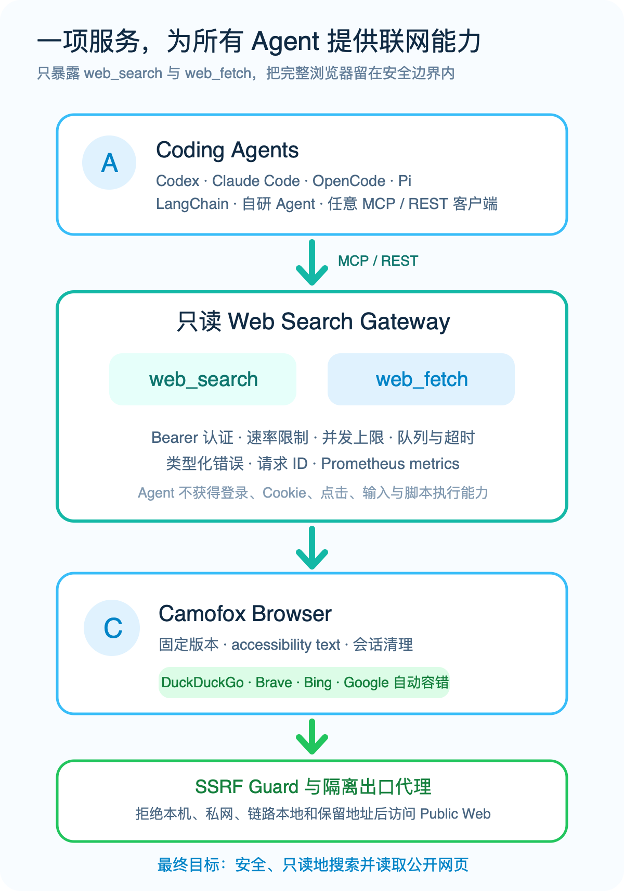
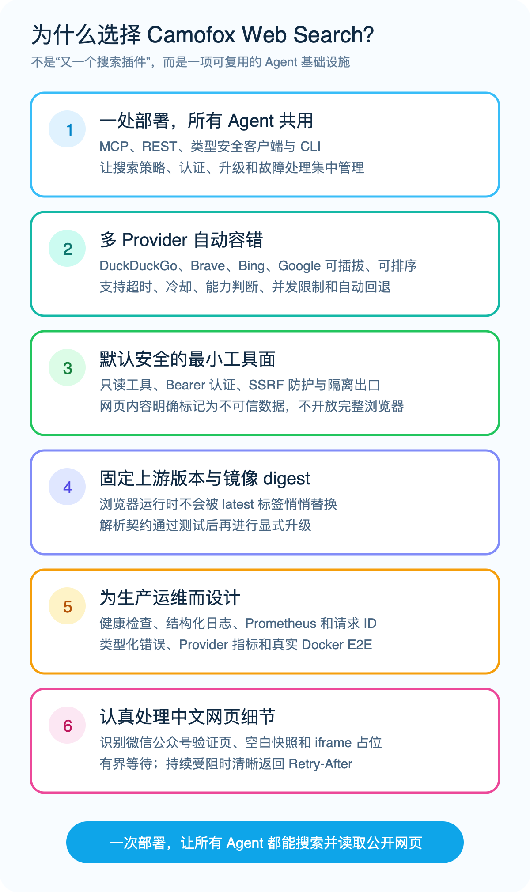

# 让 AI Agent 真正看见互联网：我们开源了 Camofox Web Search


> 一个面向 Codex、Claude Code、OpenCode、Pi、LangChain 与自研 Agent 的自托管 Web Search 服务。一次部署，通过 MCP 或 REST，让所有 Agent 都能搜索并读取公开网页。

大语言模型知道很多，却不一定知道“现在”。

今天刚发布的软件版本、几分钟前发生的新闻、不断变化的价格、刚刚更新的技术文档，以及只存在于某个网页深处的信息，都不在模型参数里。面对这些问题，一个没有联网能力的 Agent 只能拒绝回答，或者凭旧知识猜测。

所以，当 AI 从聊天助手走向真正执行任务的 Agent，Web Search 很快就会从“锦上添花的插件”变成基础设施。

但让 Agent 联网，绝不只是给它一个搜索框：它需要发现网页、读取正文、比较来源、处理失败、保留引用；同时还必须避免网页访问内网、恶意页面诱导模型执行指令、登录凭据被带到不可信站点等风险。

为了解决这组问题，我们开发并开源了 [Camofox Web Search](https://github.com/idefav/web-search)。它不试图成为另一个万能浏览器，而是把 Agent 最常用的两个联网动作——`web_search` 与 `web_fetch`——做成一项固定版本、只读、安全分层、可观测、能够被不同 Agent 共享的服务。

本文先解释一套完整的 Web Search 能力，再比较当前主流实现路线，最后介绍这个项目为什么值得尝试。

## Web Search，不只是“搜一下”

从用户提出问题，到 Agent 给出一段有出处的回答，至少要经过五个环节：

1. **发现（Search）**：获得标题、URL、摘要和排序。
2. **读取（Fetch）**：打开候选 URL，渲染页面并提取正文。
3. **筛选（Select）**：检查相关性、时效性、来源质量与多样性。
4. **综合（Synthesize）**：比较多个来源，识别并处理冲突。
5. **引用（Cite）**：保留最终 URL，让读者能够回到原文核验。



*图 1：Search 负责发现，Fetch 负责取证，URL 让答案可验证。*

搜索和抓取尤其容易被混为一谈。

只给模型搜索摘要，它可能根据几个不完整片段过度推断；只给模型网页抓取，它又不知道应该从哪里开始。生产级方案通常要同时提供 Search 与 Fetch，并把来源地址一直保留到最终回答。

还有一个常被忽略的事实：**网页是外部输入，不是可信指令。** 页面可能包含广告、隐藏文字，甚至专门针对 Agent 的 Prompt Injection。联网能力的正确目标，不是给模型一台不受限制的浏览器，而是提供完成研究所需的最小工具，并在协议、应用和网络层同时建立边界。

## 当前 Web Search 的五种主流实现路线

Web Search 没有唯一正确的技术路线。不同方案在接入速度、控制力、运行成本、数据边界和运维责任之间交换筹码。



*图 2：五种常见路线各有优势，选择取决于业务真正重视什么。*

### 路线一：商业搜索 API——最快上线

[Brave Search API](https://api-dashboard.search.brave.com/app/documentation)、[Tavily](https://www.tavily.com/product) 一类托管服务直接返回结构化搜索结果，有的还会提供为 LLM 准备的页面内容、抽取、爬取与研究能力。

它们的优势是接入快、结果稳定、延迟相对可预期，团队无需维护浏览器、代理与搜索页面解析器。代价是按量付费、依赖第三方凭据和服务策略，查询数据也会离开自己的基础设施。

如果目标是快速验证产品，或者业务必须依赖明确 SLA，商业 API 往往是最省心的选择。

### 路线二：模型平台内置搜索——开发路径最短

部分模型平台已经把 Web Search 变成原生工具：开发者允许模型调用工具，平台负责搜索、选材、综合与引用。

这种方式非常适合快速搭建问答和研究应用，但搜索 Provider、缓存、原始返回结构和网络出口通常不完全由应用控制，也难以让不同平台上的 Agent 共用同一套实现。

它解决的是“让这个平台上的模型联网”，而不是“建设一项平台无关的联网基础设施”。

### 路线三：元搜索——一个入口聚合多个上游

[SearXNG](https://docs.searxng.org/) 是开源元搜索的代表。它通过适配器连接不同搜索引擎，再对结果进行聚合，支持丰富的引擎、类别与语言设置。

元搜索的价值是自托管、来源多样和策略可配。但自托管元搜索并不等于拥有自己的搜索索引：查询仍然会发往外部搜索引擎，上游的页面变化、限流和封禁依然存在。接入 Agent 时，团队还要继续补齐正文抓取、输出裁剪、错误语义和安全网关。

### 路线四：浏览器驱动——把真实网页当作接口

这类方案启动受控浏览器，访问搜索结果页或目标网页，再从 DOM、可访问性树或渲染结果中提取内容。

它不要求商业搜索 API Key，可以读取依赖 JavaScript 的页面，也能组合多个公开搜索入口。相应地，浏览器比纯 HTTP API 更重，搜索页面结构可能变化，上游也可能限流或要求交互验证。并发、超时、会话清理、代理、安全与监控都要由部署方负责。

Camofox Web Search 选择的就是这条路线：用更多工程控制换取自托管、跨 Agent 复用和清晰的数据边界。

### 路线五：自建爬虫与索引——控制力最高

最后一种路线是持续抓取目标网络，建立倒排索引或向量索引，再自行完成召回和排序。

它适合企业内部资料、垂直行业站点与固定语料，不适合轻量覆盖整个公开互联网。团队需要长期解决抓取调度、去重、更新、垃圾内容、版权合规、索引存储与质量评估。

如果业务竞争力不在索引本身，通常应该从 API、元搜索或浏览器网关开始，而不是第一天就重建搜索引擎。

## 开源生态已经很好，为什么还要做这个项目？

开源生态里有很多优秀工具，但它们解决的问题层次并不相同。

[SearXNG](https://github.com/searxng/searxng) 是成熟的多引擎元搜索；[Firecrawl](https://github.com/firecrawl/firecrawl) 擅长把 Search、Scrape 与 Crawl 组合成面向 AI 的内容平台；[Crawl4AI](https://github.com/unclecode/crawl4ai) 是灵活的 LLM 友好浏览器抓取与抽取框架；[Camofox Browser](https://github.com/jo-inc/camofox-browser) 则把 Firefox/Camoufox 的浏览器能力封装为面向 Agent 的 REST 服务。

这些项目能力很强，但对 Coding Agent 的日常研究场景来说，直接暴露完整浏览器或站点级爬取平台往往太宽；每一种 Agent 又各自安装一套搜索插件，则会让凭据、版本、故障和安全策略散落在不同机器上。

我们真正需要的是一个更窄、更容易共享的中间层：

- 上游可以使用真实浏览器和多个搜索入口；
- 下游只看到标准、只读的 Search 与 Fetch；
- 认证、网络隔离、超时、容错与监控由服务端统一负责；
- Codex、Claude Code、OpenCode、Pi、LangChain 与内部系统都能连接同一个 endpoint。

这就是 Camofox Web Search 的定位。

## Camofox Web Search 是什么？

Camofox Web Search 是一个 MIT 开源、自托管的 Web Search 服务。它封装固定版本的 Camofox Browser REST API，但不维护上游 Fork；对 Agent 只公开两个高层工具：

- `web_search`：搜索公开网络，返回排序、标题、URL、摘要、实际 Provider 和告警。
- `web_fetch`：读取公开 HTTP(S) 页面，返回 accessibility text、最终 URL、截断状态与下一段偏移量。

服务同时提供无状态 Streamable HTTP MCP、REST API、OpenAPI 文档、类型安全 TypeScript 客户端、Agent 配置安装器和 Pi 原生插件。



*图 3：完整浏览器留在服务端安全边界内，Agent 只获得两个只读工具。*

默认情况下，搜索会按 DuckDuckGo、Brave、Bing、Google 的顺序尝试 Provider。Gateway 通过浏览器打开搜索结果页，再由适配器生成统一结果。

如果某个 Provider 返回挑战页或不完整页面，它会进入默认五分钟冷却期，请求自动尝试下一个 Provider。Google 默认限制单并发，避免无意义的并发冲击。

抓取时，服务先检查目标 URL，再在浏览器完成跳转后检查最终 URL；返回适合 Agent 阅读的可访问性文本，而不是把整页 HTML、脚本和样式塞进上下文。长页面还能通过 `offset` 与 `max_chars` 分段读取。

## 六个值得推广的项目优势



*图 4：项目关注的不只是“能搜到”，更是如何长期、稳定、安全地提供搜索。*

### 1. 一次部署，服务所有 Agent

Codex、Claude Code、OpenCode 和 Pi 可以通过 CLI 安装器幂等配置；LangChain、自研 Agent 与内部服务可以直接使用 MCP 或 REST。

搜索策略、认证、升级、监控和故障处理都集中在服务端。增加一个新 Agent，不需要再次实现一遍搜索，也不需要复制一套浏览器环境。

### 2. 不绑定单一搜索 Provider

单一 Provider 的风险不只是服务宕机，还包括地区差异、页面改版、临时验证和过滤能力不同。

项目把 DuckDuckGo、Brave、Bing、Google 设计成可插拔 Provider，支持排序、能力判断、独立并发限制、超时、冷却和自动回退。调用方能够看到实际使用的 `provider`、`provider_fallback`、`partial_results` 等信息。

失败也不会被压成一句模糊的“搜索失败”，而是 `search_blocked`、`upstream_timeout`、`upstream_contract_changed` 等类型化错误，并带有是否可重试及 `Retry-After`。

### 3. 安全不是一句 Prompt，而是多层边界

项目从多个层面收紧攻击面：

- Gateway 强制 Bearer Token，并提供速率限制、并发上限、队列和超时。
- `web_fetch` 在访问前和最终跳转后都检查公共 URL。
- 浏览器位于内部网络，出站流量经过 Squid，拒绝本机、私网、链路本地和保留地址。
- MCP 工具声明只读、非破坏性、幂等，并明确标记网页内容为“不可信数据”。
- 对外不提供 Cookie 导入、登录、点击、输入和脚本执行能力。
- 浏览器服务不直接暴露给 Agent，默认关闭崩溃遥测与默认扩展。

Prompt Injection 不可能靠一句系统提示彻底解决，但“最小权限 + 网络隔离 + 输入标记 + 调用方策略”能够建立更可靠的防线。

### 4. 固定上游，减少无意漂移

浏览器型方案很怕一次无意升级改变快照契约。项目把 Camofox Browser 固定到明确版本和多平台镜像 digest，Provider 解析器围绕该版本的 accessibility snapshot 编写测试。

固定版本不能阻止搜索引擎改版，却能消除一个重要变量：自己的浏览器运行时不会被 `latest` 标签悄悄替换。升级需要显式评审与验证。

### 5. 从“代码能跑”走向“服务能运维”

项目内置存活与就绪检查、结构化日志、Prometheus metrics、请求 ID、Provider 尝试/耗时/回退指标、冷却电路状态和抓取就绪事件。

Docker Compose 会编排 Gateway、浏览器、隔离出口与数据初始化，默认只监听 `127.0.0.1`。真实 Docker E2E 覆盖认证、公开网页抓取、元数据地址拒绝、搜索成功或类型化失败、MCP 工具发现与调用，以及浏览器会话清理。

对 Agent 基础设施来说，明确的失败语义与可观测性，和“成功搜到一次”同样重要。

### 6. 认真处理中文网页的真实细节

微信公众号文章可能短暂经过验证中间页，也可能先返回空白快照或只有 iframe 的占位内容。

`web_fetch` 会执行有界就绪等待：页面自动恢复后继续读取；持续需要交互验证时，则返回 HTTP 503、`fetch_blocked` 和 `Retry-After`，而不是把验证页误当正文。最终 URL 中的微信临时 `poc_token` 也会被移除。

项目不会尝试破解 CAPTCHA。“识别、等待、清晰失败”比无限重试或伪造成功更适合自动化系统。

## 五分钟接入你的 Agent

服务端按照[部署指南](../docs/content/zh-CN/deployment.md)启动后，Agent 侧只需安装 CLI，并通过安全方式提供 API Key：

```bash
npm install -g camofox-web-search
export WEB_SEARCH_API_KEY="<通过安全渠道获得的 Key>"

camofox-web-search install codex \
  --endpoint https://search.example.com \
  --scope user

camofox-web-search doctor codex \
  --endpoint https://search.example.com \
  --scope user \
  --live
```

把 `codex` 换成 `claude`、`opencode` 或 `pi`，即可为不同 Agent 安装同一服务。安装器只保存 endpoint 和环境变量引用，不把 Token 写进配置。

也可以直接调用 REST：

```bash
curl --fail https://search.example.com/v1/search \
  -H "Authorization: Bearer $WEB_SEARCH_API_KEY" \
  -H "Content-Type: application/json" \
  -d '{
    "query": "AI Agent web search architecture",
    "count": 5,
    "freshness": "month",
    "language": "en"
  }'
```

Search 支持时间范围、包含/排除域名、语言和国家过滤；Fetch 支持最大字符数和分段偏移。更多示例见[中文 README](../README.zh-CN.md)与[示例文档](../docs/content/zh-CN/examples.md)。

## 它适合谁，也不适合谁

Camofox Web Search 尤其适合这些场景：

- 团队同时使用多种 Coding Agent，希望共用一项联网服务；
- 不希望为每个 Agent 分发不同的商业搜索 API Key；
- 希望搜索和抓取流量留在自己控制的主机与网络策略中；
- 需要 MCP 与 REST 双入口、类型化错误、监控和可重复部署；
- 只需要公开网页的只读研究能力，不想把完整浏览器权限交给模型。

它也不是所有问题的最佳答案：

- 如果最重要的是最低延迟、全球 SLA 和免运维，商业 Search API 更合适。
- 如果要持续爬取整站、抽取复杂 Schema 或建设数据集，应选择 Firecrawl、Crawl4AI 或专门的数据管道。
- 如果要登录网站、填写表单、下载文件或完成交易，需要带审批、凭据隔离和审计的浏览器自动化系统。
- 如果要检索固定私有资料，应该建立自己的 RAG 索引。
- 如果业务要求稳定的全网覆盖与排序质量，最终仍可能需要独立索引 API，或将其接入为新的 Provider。

浏览器搜索还必须尊重目标网站的服务条款、robots 规则、版权和当地法律。自托管降低的是供应商依赖，不是合规责任。

## 结语：把联网能力变成可复用的基础设施

Agent 联网真正困难的地方，从来不是发出一次 HTTP 请求，而是持续回答这些问题：

信息从哪里来？页面真的被读到了吗？答案能否核验？上游被拦截时会怎样？失败是否可以重试？网页能否访问内网？恶意内容会不会反过来控制 Agent？多个工具是否正在重复维护同一套能力？

Camofox Web Search 的选择很克制：不做万能浏览器，不重建搜索引擎索引，也不把完整研究流程塞进黑盒 API。它只把最通用的两个动作——搜索与读取——做成一项固定版本、只读、安全分层、可观测、可被多种 Agent 共享的服务。

如果你也需要“一次部署，让所有 Agent 都能可靠地搜索和读取公开网页”，欢迎：

- 访问 [GitHub 项目](https://github.com/idefav/web-search)，如果项目对你有帮助，欢迎点一个 Star；
- 阅读[在线中文文档](https://idefav.github.io/web-search/zh-CN/)；
- 从 Docker 自托管开始体验，并通过 Issue 分享你的使用场景和反馈。

让 Agent 拥有互联网并不难。难的是让这双“眼睛”足够可靠、克制，而且始终处在可控边界之内。

---

## 参考资料

- [Brave Search API Documentation](https://api-dashboard.search.brave.com/app/documentation)
- [Tavily Product and API](https://www.tavily.com/product)
- [SearXNG Engine Overview](https://docs.searxng.org/dev/engines/engine_overview.html)
- [Firecrawl Search API](https://docs.firecrawl.dev/api-reference/endpoint/search)
- [Crawl4AI](https://github.com/unclecode/crawl4ai)
- [Camofox Browser](https://github.com/jo-inc/camofox-browser)

> 微信公众号封面另提供 `articles/assets/web-search-cover-wechat.png`（900×383），正文与技术博客共用以上配图。
